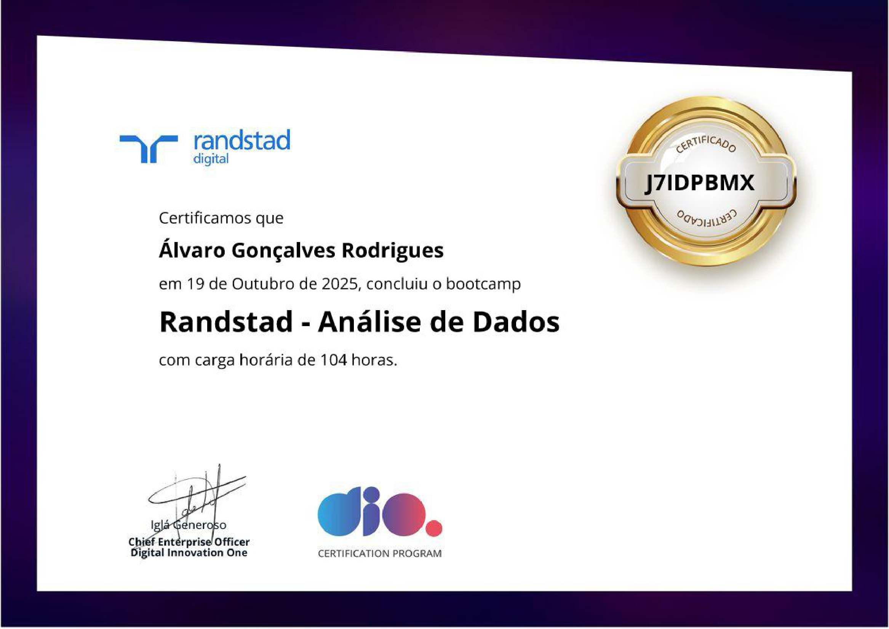

# 📊 Bootcamp DIO | Randstad – Análise de Dados  

Esse repositório é o **índice geral** dos projetos que desenvolvi durante o bootcamp **Randstad – Análise de Dados** da **Digital Innovation One (DIO)**.  
Aqui reuni tudo que produzi: modelagens de banco, dashboards, integrações e desafios que realmente me fizeram entender o processo de análise de dados do zero ao Power BI conectado no Azure.

> Nada aqui é “feito por fazer” — cada entrega me ensinou algo prático, seja SQL, BI, IA ou organização de projetos.

---

 ## 🎓📜 Certificado de Conclusão

[📜 Abrir Certificado em PDF](./certificado.pdf)

---

## 🧩 Projetos Entregues  

| Projeto | Descrição | Link |
|----------|------------|------|
| 🛍️ **Banco de Dados – E-commerce** | Criação de um banco de dados completo para um e-commerce, do modelo conceitual ao script SQL no MySQL. | [🔗 Repositório](https://github.com/AlvaroGR028/bootcamp-dio-ProjLogicoBD) |
| 🧰 **Banco de Dados – Oficina Mecânica** | Modelo conceitual e lógico de um sistema para ordens de serviço em uma oficina mecânica. | [🔗 Repositório](https://github.com/AlvaroGR028/oficina-mecanica-diagrama) |
| 📈 **Dashboard de Vendas – Xbox Game Pass (Excel)** | Dashboard anual e mensal com indicadores de assinaturas, valores e desempenho. | [🔗 Repositório](https://github.com/AlvaroGR028/bootcamp-dashboard-xbox) |
| 💼 **Dashboard de Vendas – Financial Sample (Power BI)** | Dashboard em Power BI com três páginas, incluindo nova página de visuais criados por mim. | [🔗 Repositório](https://github.com/AlvaroGR028/Bootcamp-Dio-DashboardFinancials) |
| 📊 **Relatório Gerencial de Vendas (Power BI)** | Relatório interativo aplicando segmentações, navegação e boas práticas visuais. | [🔗 Repositório](https://github.com/AlvaroGR028/bootcamp-Dio-RelatorioGerencialVendas) |
| 🌐 **Integração MySQL + Power BI + Azure** | Projeto completo unindo banco de dados SQL, integração na nuvem e análise no Power BI. | [🔗 Repositório](https://github.com/AlvaroGR028/Bootcamp-DIO-AzureSql) |

---

## 🧠 O que aprendi (na prática)

- **Banco de Dados:** modelagem conceitual, lógica e física (MySQL)  
- **Power BI:** criação de dashboards limpos, interativos e com propósito  
- **Excel:** análise de dados e indicadores visuais  
- **Azure & Integração:** conexão entre dados locais e nuvem  
- **IA Generativa & Copilot:** apoio na produtividade e estruturação de código  
- **Git & GitHub:** controle de versão, organização e documentação  

---

## ⚙️ Ferramentas que usei  

| Área | Ferramentas |
|------|--------------|
| Banco de Dados | MySQL Workbench, SQL Server |
| Visualização | Power BI, Excel |
| IA & Nuvem | Azure ML, Copilot |
| Versionamento | Git, GitHub Desktop, VS Code |

---

## 🧭 Estrutura dos Repositórios  

Cada projeto individual contém:
- Diagramas e scripts SQL  
- Dashboards (Excel ou Power BI)  
- Prints de resultados e documentação  
- README explicando contexto e entregas  

---

## 🚀 Próximos Passos  

- [x] Modelagem E-commerce  
- [x] Modelagem Oficina Mecânica  
- [x] Dashboard Xbox (Excel)  
- [x] Dashboard Financial Sample (Power BI)  
- [x] Relatório Gerencial (Power BI)  
- [x] Integração Azure + Power BI  
- [ ] Revisar documentação final e publicar certificado  

---

> Repositório mantido por **Álvaro Gonçalves Rodrigues**  
> Bootcamp: **Randstad – Análise de Dados | DIO.me**  
> “Aprender é bom, mas ver o resultado rodando é melhor ainda.” 🚀
